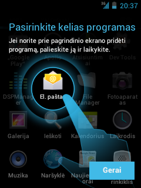
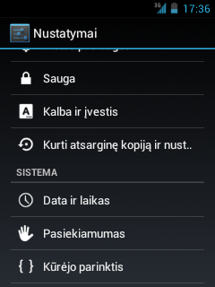
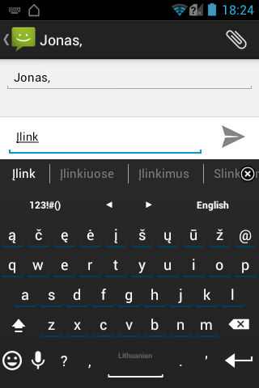

Bemaž visų dabar parduodamų „Android“ įrenginių programinė įranga yra lokalizuota, o kalbų ir klaviatūrų perjungimas
juose vykdomas atitinkamame sistemos nustatymų skyriuje (pvz., nuotraukoje – „Kalba ir įvestis“). Be to, dauguma
įrenginių suteikia galimybę pasirinkti sąsajos kalbą iš sąrašo pirmojo paleidimo metu, arba atkūrus gamyklinius
įrenginio parametrus.

Jei visgi jūsų įrenginys neturi lietuvių kalbos, padėti gali atitinkamo regiono programinės įrangos įrašymas į jį, o jei
tokio nėra ar jis vis tiek neturi lietuvių kalbos – modifikuoti (neoficialūs) „Android“ atvaizdžiai,
pavyzdžiui, „[Lineage OS](http://lineageos.org/)“ (buvęs „CyanogenMod“). Atvaizdžių savo įrenginiams taip pat galima
ieškoti [XDA forume](http://forum.xda-developers.com/), o šiek tiek instrukcijų lietuviškai –
rasti [„Androidmanijos“ forume](http://www.androidmanija.lt/forum/). Deja, bet mažiau populiariems įrenginiams
patobulinto „Androido“ gali ir nebūti. Be to, derėtų nepamiršti, jog, perrašant operacinę sistemą neoficialiu būdu,
galima prarasti įrenginio garantiją ar net jį sugadinti.

Rašymas lietuviškai „Android“ įrenginiais
=========================================

Rašymas ekranine klaviatūra
---------------------------

{.alignright}

Dauguma „Android“ įrenginių galima rašyti lietuviškai. Deja, neretai tai nepatogu, nes specifinės lietuviškos raidės
ekraninėse klaviatūrose būna pasiekiamos tik ilgai palaikius pamatinę raidę (pvz., norint parašyti „Ą“, reikia ilgai
palaikyti ekraninės klaviatūros klavišą „A“). Laimei, „Android“ įrenginiuose galima diegti papildomas ekranines
klaviatūras. Jei jūsų telefono gamyklinė ekraninė klaviatūra jūsų netenkina ir norite naudotis patogesne, siūlome
išbandyti atvirojo kodo [„AnySoftKeyboard“](https://anysoftkeyboard.github.io/) bei jai skirtą
[lietuviškų išdėstymų paketą](https://anysoftkeyboard.github.io/languages/) – jame rasite net keletą lietuviškų
išdėstymų, iš kurių galėsite pasirinkti labiausiai patinkantį.

Rašymas fizine klaviatūra
-------------------------

Norint prie „Android“ įrenginio prijungti fizinę klaviatūrą, „AnySoftKeyboard“ klaviatūros nepakaks. Jei naudojatės 5.0
ar aukštesnės versijos „Android“ sistema, savo įrenginį susieję su išorine klaviatūra, norimą jos išdėstymą galėsite
pasirinkti įrenginio kalbinių nustatymų skyriaus poskyryje „Fizinė klaviatūra“. Visgi, gamykliškai šiame sąraše
yra tik vienas lietuviškas išdėstymas – skaitmenų eilės. Jei esate įpratę prie vieno iš ĄŽERTY išdėstymų, panašu kad jį
galite turėti jau dabar, įdiegę
[papildomų fizinių klaviatūrų išdėstymų paketą](https://github.com/calin-darie/extra-keyboard-layouts)
o jei naudojatės LEKP ar kita egzotika – pirma matyt turėsite kreiptis į autorių su prašymu, kad jis jūsų išdėstymą į šį
paketą pridėtų.

Jei naudojatės žemesne nei 5.0 „Android“ versija, tuomet atskiro nustatymų skyrelio fizinei klaviatūrai nerasite – jos
kalba bus sinchronizuojama su pasirinktos ekraninės klaviatūros kalba. Deja, dauguma ekraninių klaviatūrų neturi jokio
lietuviškos fizinės klaviatūros išdėstymo, tad lietuviškai rašyti fizine klaviatūra jos galimybės nesuteikia. Tačiau
nenusiminkite – būtent šiai problemai spręsti yra
sukurta [„External Keyboard Helper Pro“](https://play.google.com/store/apps/details?id=com.apedroid.hwkeyboardhelper)
(EKH) programa. Ją įdiegę į savo įrenginį, jo nustatymų skyriuje „Kalba ir įvestis“ pasirinktie klaviatūrą šiuo
pavadinimu, o jos nuostatose ne tik rasite populiariausiąjį lietuvišką išdėstymą, bet ir galėsite susikurti savo. Ši
programa kainuoja apie du eurus, tačiau išbandymui ir įsitikinimui, jog ji sprendžia jūsų problemą, galite nemokamai
įdiegti jos demonstracinę
versiją [„External Keyboard Helper Demo“](https://play.google.com/store/apps/details?id=com.apedroid.hwkeyboardhelperdemo).
Atkreipiame dėmesį, jog abi šios programos „apsimeta“ ekranine klaviatūra, tačiau ekrane jokios klaviatūros nerodo, tad
norėdami rašyti tiek fizine, tiek ekranine klaviatūromis pakaičiui, turėsite kaskart iškviesti klaviatūros perjungimo
komandą ir rinktis, kuria klaviatūra – ekranine ar EKH norite rašyti.
