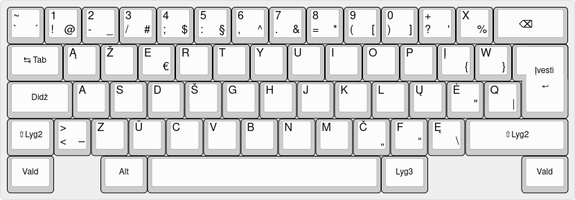
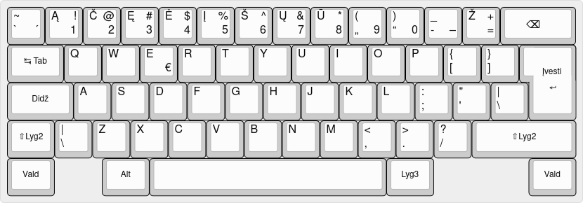
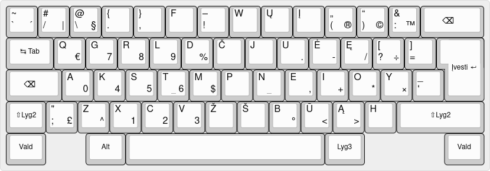
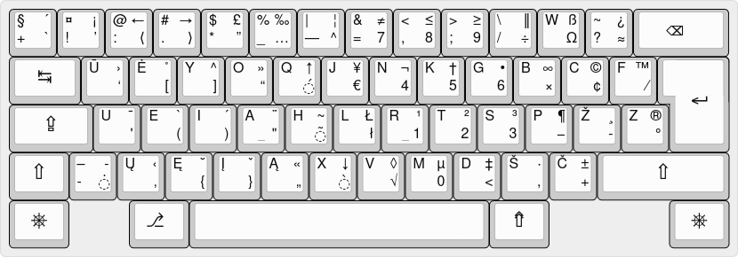
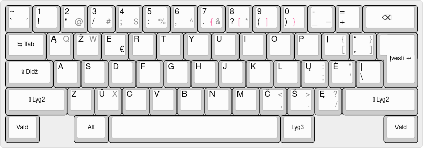

LST 1582 (lietuviška standartinė klaviatūra)
--------------------------------------------

Vienintelis Lietuvoje šiuo metu galiojantis oficialus klaviatūros standartas. Visi reikalingi simboliai išdėstyti
trijuose lygiuose. Išsamiau apie šį išdėstymą – [jo svetainėje](http://www.ims.mii.lt/klav/). Joje taip pat rasite
išdėstymo treniruokles ir keletą kitų gėrybių.

* Išdėstymo tvarkyklės gamykliškai pateikiamos kartu su „Windows“ ir „UNIX“ šeimos operacinėmis sistemomis;
* „macOS“ bei kiek kitokias „Windows“ tvarkykles galite parsisiųsti iš
  [išdėstymo svetainės](http://www.ims.mii.lt/klav/tvarkyk.html);
* fizinę klaviatūrą su šiuo išdėstymu šiuo metu galite įsigyti [LISK.lt svetainėje](https://www.lisk.lt/);
* Rimo Kudelio svetainėje galite užsisakyti [klaviatūros lipdukų, sužymėtų šiuo išdėstymu][1].

Skaitmenų eilės klaviatūros išdėstymas („Numeric“, „Baltic“)
------------------------------------------------------------

Populiariausias lietuviškas išdėstymas, kartais vadinamas „Numeric“. Jame specifinės lietuviškos raidės abėcėlės tvarka
išdėstytos skaitmenų eilės klavišuose. Skaitmenys įvedami laikant nuspaustą <kbd>Lyg3</kbd> klavišą, o spec. simboliai –
laikant kartu nuspaustus <kbd>Lyg2</kbd> ir <kbd>Lyg3</kbd> klavišus. Senesniajame „Baltic“ variante vietoj
<kbd>Lyg3</kbd> naudojamas tęsties klavišas <kbd>\`</kbd>. Šis išdėstymas nėra oficialiai standartizuotas, tačiau jo
pagrindu tapo [seno Lietuvos standarto rekomenduojamas priedas]().

* Šis išdėstymas pateikiamas gamykliškai ir yra numatytasis lietuvių kalbai kone visose operacinėse sistemose, o „Apple“
  gaminiuose jo „Baltic“ variantas apskritai yra vienintelis gamykliškai platinamas lietuviškas klaviatūros išdėstymas.
* su „Windows“ pateikiamame išdėstyme nenumatytas lietuviškų figūrinių kabučių ir brūkšnio ženklo įvedimas;
* iš [Rimo Kudelio svetainės](https://rimas.kudelis.lt/numeric/) galite parsisiųsti „Numeric“ išdėstymo tvarkykles su
  figūrinėmis kabutėmis ir brūkšniu „Windows“ ir „macOS“ sistemoms;
* kiek kitaip „Windows“ išdėstymą [yra papildžiusi „Fotonija“](<Fotonijos išdėstymai.zip>) (rinkinyje jis pavadintas
  „LT Numeric“);
* „Numeric“ tipo „macOS“ išdėstymą taip pat galite parsisisiųsti iš [Ramūno Blavaščiūno][3]. Šis išdėstymas papildytas
  daugybe rečiau reikalingų ženklų ir funkcijų, tačiau pateikiamas su klaida – mažosios kirčiuotos raidės „i“, „į“ ir
  „j“ raidės juo įvedamos neteisingai (klaidingomis unikodo sekomis), tad šis išdėstymas nelaikytinas visiškai tinkamu
  lietuviškoms kirčiuotoms raidėms rinkti;
* LEKP projekto autoriai irgi yra sukūrę „Numeric“ išdėstymo atmainą, kurią pavadino
  [„Baltic+“](https://lekp.info/Išdėstymai). Bene didžiausias jos skirtumas nuo įprasto „Numeric“ išdėstymo – tai
  didžiųjų raidžių klavišo funkcijos pakeitimas, kad jis šalintų tekstą kairėn. Šio išdėstymo tvarkykles „Windows“ ir
  „macOS“ sistemoms galite parsisiųsti iš [LEKP svetainės](https://lekp.info/Tvarkyklės);
* Rimo Kudelio svetainėje galite užsisakyti [klaviatūros lipdukų, sužymėtų šiuo išdėstymu][1].

LEKP ir LEKPa
-------------

Santrumpa „LEKP“ reiškia „Lietuviškos ergonomiškos klaviatūros projektas“. Plačiau apie šio projekto sukurtus
klaviatūros išdėstymus galima paskaityti [jo svetainėje](https://lekp.info/). Ten pat rasite ir išdėstymų tvarkykles.

„UNIX“ šeimos operacinėse sistemose šį išdėstymą galima pasirinkti nieko papildomai nediegiant.

Ratisė
------

Kitas ergonominės klaviatūros projektas. Autoriaus Algirdo Buckaus teigimu, šis išdėstymas lengvai įsimenamas ir
patogiai naudojamas. Daugiau informacijos apie jį, taip pat jo tvarkyklės –
[svetainėje](https://albuck.github.io/Ratise-layout/).

„UNIX“ šeimos operacinėse sistemose šį išdėstymą galima pasirinkti nieko papildomai nediegiant.

IBM (LST 1205-92)
---

Senasis ĄŽERTY išdėstymas, įgyvendinantis LST 1205-92 „lietuviškąjį režimą“ (veikseną), dažnai vadinamas IBM
pravarde. Galbūt tokia tradicija susiklostė todėl, jog tai buvo vienintelis lietuviškas klaviatūros išdėstymas
kadaise IBM leistoje „OS/2 Warp“ operacinėje sistemoje.

Schemoje juodai atvaizduoti ženklai, nurodytose pozicijose esantys tiek „Windows“, tiek „UNIX“ šeimos operacinių sistemų
gamykliniuose „IBM“ išdėstymuose; pilkai – tik „UNIX“ šeimos, raudonai – tik „Windows“.

Kaip matyti iš schemos, su „Windows“ sistemomis gamykliškai pateikiamame IBM išdėstyme nenumatytas kai kurių ženklų,
kaip kad „@“, „Q“, „W“, „X“, įvedimas. Patobulintas šio išdėstymo [„Windows“ tvarkykles](<Fotonijos išdėstymai.zip>)
yra sukūrusi „Fotonija“. Išdėstymas rinkinyje pavadintas „LT Universal“. Jis panašus į „UNIX“ šeimos sistemose
pateikiamą išdėstymą, tačiau sutampa ne visiškai.

Kiti išdėstymai
---------------

Be paminėtų aukščiau, yra ir dar rečiau naudojamų lietuviškų klaviatūros išdėstymų. Pavyzdžiui, „Programuotojų“
išdėstymuose lietuviškos raidės dažnai nukeliamos į trečiąjį ir ketvirtąjį klaviatūros lygius, arba įvedamos naudojantis
tęsties klavišais. Be to, šiais laikais kone kiekvienas gali net ir nemokamomis priemonėmis susikurti savo klaviatūros
išdėstymą.

Kirčiuotų raidžių įvedimas
--------------------------

Šiame straipsnyje lietuviškų kirčiuotų raidžių įvedimas kol kas paliestas tik minimaliai. Kirčiuotoms raidėms įvesti
paprastai kuriami atskiri klaviatūros išdėstymai, papildantys kurio nors jau esamo išdėstymo funkcionalumą.

Atkreipsime dėmesį, jog esti **tam tikrų niuansų**, susijusių būtent su kirčiuotų lietuviškų raidžių įvedimu. Dalis šių
kirčiuotų raidžių neturi atskirų kodų unikode, todėl turi būti išreiškiamos kodų sekomis, prie atitinkamos pamatinės
raidės „prikabinant“ kombinacinius kirčio ženklus. Dar įdomiau yra su kirčiuotomis mažosiomis „i“, „į“ ir „j“ raidėmis,
mat jų atveju tarp pamatinės raidės ir kombinacinio kirčio kodo reikia įterpti dar ir kombinacinį tašką! Visa tai
nekeltų didelių problemų, jei ne vienas iš „Windows“ klaviatūros išdėstymų tvarkyklėms taikomų apribojimų – panaudojus
tęsties klavišą, nebelieka galimybės vienu tolesniu klavišo paspaudimu įvesti daugiau kaip vieną unikodo kodą. Dėl šios
priežasties „Windows“ sistemose bent dalį kirčiuotų raidžių tenka vesti ne taip patogiai, kaip norėtųsi: pirma įvedama
pamatinė raidė, o tada reikiami kombinaciniai ženklai. Visgi galime pasidžiaugti nors tuo, kad ši problema yra būdinga
tik vienai operacinei sistemai.

Kitas niuansas – **šriftai**. Dažnas šriftas neturi iš anksto sukomponuotų _glifų_ kirčiuotoms raidėms, todėl tokias
raides iš kitų _glifų_ komponuoja jūsų naudojama programinė įranga. Kartais toks komponavimas duoda ne patį geriausią
rezultatą, pavyzdžiui, kirčio ženklas gali būti pasislinkęs į šoną ar sulipęs su raide, o minėtų mažųjų raidžių su
taškais atveju būna, jog kombinaciniai ženklai nepašalina taško nuo pamatinės raidės (nors turėtų!), todėl kirčiuota
raidė gali būti atvaizduojama su dviem taškais ir dar kirčio ženklu.

Būtent dėl pataikavimo netinkamiems šriftams Ramūno Blavaščiūno „macOS“ išdėstyme dalis kirčiuotų raidžių yra koduojamos
neteisingai. Tačiau derėtų suprasti, kad toks sprendimas yra labai laikinas ir nepatvarus, nes kiekvienas ženklas tekste
turi ne tik išvaizdą, bet ir prasmę. Neteisingai koduojant raides, jų prasmė iškreipiama, ir tai vėliau gali turėti
neigiamos įtakos ne tik raidės išvaizdai, bet ir kitiems dalykams: pavyzdžiui, ji gali būti blogai atvaizduojama,
pasirinkus kirčiuotam lietuviškam tekstui tinkamesnį šriftą, gali būti neteisingai keičiama iš mažosios į didžiąją ar
atgal, neteisingai tariama ar išvis netariama teksto skaitymo balsu programos ir pan.

Kad su tokiomis problemomis nesusidurtumėte, rašydami kirčiuotą tekstą stenkitės naudoti tuos šriftus, kuriuose
lietuviškos kirčiuotos raidės atvaizduojamos teisingai. Jei jūsų turimi šriftai tuo nepasižymi, parsisiųskite,
įsidiekite ir naudokitės [„Palemonu“][2] ir [„Aistika“](https://clarin.vdu.lt/xmlui/handle/20.500.11821/48).

„Windows“ sistemose kirčiuotas raides galima rinkti standartinio išdėstymo pagrindu parengtu išdėstymu, platinamu
[„Palemono“ tinklalapyje][2] bei jau minėtais [„Fotonijos“ išdėstymais](<Fotonijos išdėstymai.zip>) (tiesa, šio paketo
instrukcijoje nedetalizuota, kaip tai gali būti daroma), o „macOS“ sistemose –
[Rimo Kudelio platinamu „Accented“ išdėstymu](https://github.com/rimas-kudelis/macos-keyboard-layouts)
(šis irgi parengtas standartinio pagrindu), arba [Ramūno Blavaščiūno „skaičių eilės“ išdėstymu][3]
(kirčiuotas „i“, „į“ ir „j“ kombinuojant savarankiškai). Kirčiuotas raides taip pat galima kombinuoti, naudojantis
[„Ratisės“ išdėstymu](#ratisė), kurio trečiajame lygyje yra visi trys tam reikalingi kombinaciniai kirčiai ir
kombinacinis taškas. Be to, „Ratisėje“ yra ir tęsties klavišų. 

„Android“, „iOS“ ir „iPadOS“ klaviatūros
----------------------------------------

Bene visais išmaniaisiais telefonais ir planšetiniais kompiuteriais galima rašyti lietuviškai, tačiau kartais tai
nepatogu, nes savitosios lietuviškos raidės būna „paslėptos“ po pamatinėmis. Laimei „iOS“ ir „iPadOS“ įrenginiuose
galima diegti papildomas ekranines klaviatūras ir išdėstymus, o „Android“ įrenginiuose – dar ir papildomus fizinės
klaviatūros išdėstymus. Plačiau apie tai – skyreliuose
[„Android“ lietuvinimas“]()
ir [„iOS“ lietuvinimas“]().

Pastabos ir nuorodos
--------------------

1. Pirminis „Fotonijos“ išdėstymų šaltinis – [programos „Mainukai“ tinklalapis](http://fotonija.lt/mainukai_details.php).
   Mūsų svetainėje platinamas perpakuotas šių išdėstymų rinkinys su pataisyta technine klaida faile `Info.html`;
2. <kbd>Lyg3</kbd> – tai lietuviškas klavišo <kbd>AltGr</kbd>, arba dešiniojo <kbd>Alt</kbd>, pavadinimas. „Windows“
   sistemose šio klavišo funkcija taip pat atlieka laikomi kartu nuspausti <kbd>Vald</kbd>+<kbd>Alt</kbd> klavišai.  
   <kbd>Vald</kbd> – tai lietuviškas <kbd>Ctrl</kbd> klavišo pavadinimas.  
   <kbd>Lyg2</kbd> – tai lietuviškas <kbd>⇧ Shift</kbd> klavišo pavadinimas.
3. „UNIX“ šeimos operacinėmis sistemomis šiame straipsnyje vadinamos „Linux“, BSD ir kitos šiuolaikinės operacinės
   sistemos, naudojančios „freedesktop.org“ klaviatūros išdėstymų aprašus;
4. jeigu įrenginyje, kuriuo dirbate, nėra ir negalima įdiegti lietuviško klaviatūros išdėstymo, o parašyti kažką
   lietuviškai vis tiek reikia, šios svetainės skyriuje [„Nuorodos“]() rasite nuorodų į keletą
   virtualių klaviatūros išdėstymų, veikiančių tiesiog interneto naršyklėje;
5. šiek tiek senų „negamyklinių“ išdėstymų „Windows“ sistemoms galima parsisiųsti iš Registrų centro „LithWin“
   tinklalapio archyvinių kopijų: [kada.lt](https://web.archive.org/web/20070104192611/http://www.kada.lt:80/litwin/),
   [registrucentras.lt](https://web.archive.org/web/20220518055706/https://www.registrucentras.lt/litwin/);
6. kai kurių išdėstymų tvarkykles [DOS](https://gedmin.as/lit/index-lt.html) ir
   [Linux](https://gedmin.as/lit-con/index-lt.html) sistemoms yra parengęs Marius Gedminas, o
   [QNX sistemoms](http://qnx.projektas.lt/) – Linas Kavaliauskas.

[1]: https://rimas.kudelis.lt/lipdukai/
[2]: https://www.vlkk.lt/palemonas/
[3]: http://raides.blavasciunas.com/
