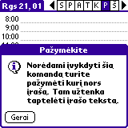
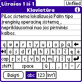

„Palm“ turi visai sulietuvintą aplinką. Yra ne tik lietuviškoms raidėms pritaikyta „Graffiti“ (rašymo ranka
atpažinimas), ekrane rodoma klaviatūra, bet išversta visa operacinė sistema. Tokį stebuklą sukūrė „Paragon Software“, ir
vadinasi jis [„PiLoc“](http://www.penreader.com/palm/lithuanian/Lithuanian_PiLoc.html). Paketas kainuoja beveik 40 JAV
dolerių, tačiau yra ir bandomoji versija, kuri padės nuspręsti, ar jis vertas investicijos.

 
