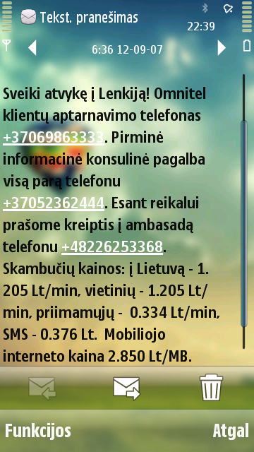

{.alignright}

Praėjusio tūkstantmečio pabaigoje greitai pradėję plisti mobilieji telefonai iš pradžių neturėjo galimybės rašyti ir
atvaizduoti specifinių lietuviškų raidžių SMS pranešimuose. SMS raidyną tuo metu sudarė tik baziniai lotyniški rašmenys
ir keletas kitų simbolių, neaktualių mūsų raštui. Dėl šios priežasties Lietuvoje susiklostė tradicija SMS siųsti
lotyniška abėcėle. Taip elgėsi ne tik privatūs asmenys, bet ir informacinių technologijų lyderiai, ryšių operatoriai,
pardavėjai, bankai, reklamos siuntėjai. 1996 m. atitinkami standartai buvo papildyti galimybe siųsti pranešimus bet
kokiais rašmenimis. Deja, blogų įpročių nėra lengva atsisakyti. Net praėjus dešimtmečiams nuo daugiakalbių SMS standarto
patvirtinimo, didelė dalis lietuvių – privatūs asmenys, ryšio paslaugų teikėjai, biudžetinės įstaigos, bankai ir kitos
organizacijos – vis dar yra linkę siųsti „sveplus“ SMS pranešimus savo klientams. Paprastai tai motyvuojama patogumu,
patikimumu ir kaina. Pabandysime paanalizuoti šiuos argumentus ir įrodyti, jog **lietuviškai rašyti SMS pranešimus
tikrai galima**. Beje, taisyklingai rašyti klientams siunčiamus SMS pranešimus jau nuo 2012
metų [reikalauja ir Valstybinė kalbos inspekcija bei Valstybinė lietuvių kalbos komisija](https://www.vlkk.lt/naujienos/kitos-naujienos/del-lietuvisko-raidyno-informacinese-trumposiose-zinutese-sms "Valstybinė lietuvių kalbos komisija – Dėl lietuviško raidyno informacinėse trumposiose žinutėse (SMS)").

Patogumas
---------

Patogumas – pirmasis kriterijus mūsų sąraše. Iš tikrųjų, mygtukiniuose telefonuose dažnu atveju specifinei lietuviškai
raidei įvesti reikia daugiau klavišo paspaudimų, negu bazinei lotyniškai. Išmaniuosiuose telefonuose šių raidžių
įvedimas taip pat neretai apsunkinamas, paslepiant jas po pamatinėmis. Vis dėlto, išmaniuosiuose telefonuose paprastai
galima įdiegti papildomus klaviatūros išdėstymus, ir bent jau populiariausioms šių įrenginių platformoms – „Android“ ir
„iOS“ – lietuviški išdėstymai su patogiai pasiekiamais visais lietuviškais rašmenimis yra sukurti ir platinami (juos
paminėjome skyreliuose apie šių platformų sulietuvinimą). Be to, daugumoje ne tik išmaniųjų telefonų galima įjungti
žodžių nuspėjimo funkciją – jei labai skubate, siūlome ją išbandyti.

Patikimumas
-----------

Ryšių operatoriai jau neneigia, kad lietuvybė SMS pranešimuose galima. Tačiau vis dar yra vengiančių juose rašyti
lietuviškai ir tai motyvuojančių noru, kad pranešimą galėtų perskaityti visų – net ir labai senų ar egzotinių – telefono
aparatų naudotojai. Tačiau dabar absoliuti dauguma mobiliųjų telefonų geba taisyklingai rodyti daugiakalbes
žinutes. [Dar 2006-aisiais atlikome daugiau kaip 40 skirtingų telefonų aparatų testus](https://web.archive.org/web/20100116145847/http://papartis.infoseka.lt/sms.htm),
ir iš jų vos du nerodė lietuviškų pranešimų. Galbūt, gerai pasistengus, tokių išimčių pavyktų rasti ir dabar, tačiau ar
tikrai verta „šlubuoti“ vardan keleto senų neįgalių įrenginių?

Kaina
-----

Dar vienas dažnas argumentas prieš rašymą taisyklingai – lietuviškų pranešimų kaina. Teigiama, jog lietuviškomis
raidėmis parašyta žinutė bus dvigubai brangesnė, negu parašyta vien bazinėmis raidėmis. Tai iš dalies tiesa: kadangi
pranešimus su specifiniais lietuviškais rašmenimis tenka koduoti kitaip, į juos telpa mažiau simbolių, negu į
„sveplus“ – ne 160, bet 70. Tačiau tai reiškia, kad iki 70 ženklų apimties lietuviški pranešimai netampa brangesni – tik
ilgesnius tenka skaidyti į atskiras dalis, kurių kiekviena siunčiama ir apmokestinama kaip atskiras pranešimas, o gavėjo
telefonas jas vėl sujungia į vientisą tekstą. Tačiau ar dažnai SMS žinutėse rašome eilėraščius ar rašinius? Juk
dažniausiai žinutę sudaro vos keletas žodžių, kurių apimtis vargu ar siekia tą 70-ies simbolių ribą. Taigi, nerimas dėl
kainos dažniausiai yra nepagrįstas. Be to, šiais laikais, kai bemaž visi mobiliojo ryšio paslaugų planai apima ir
galimybę siųsti tūkstančius žinučių per mėnesį, o mobilusis internetas daugumai tapęs neatsiejama gyvenimo dalimi,
kalbėti apie taupymą lietuvybės sąskaita atrodo visai nerimta.
