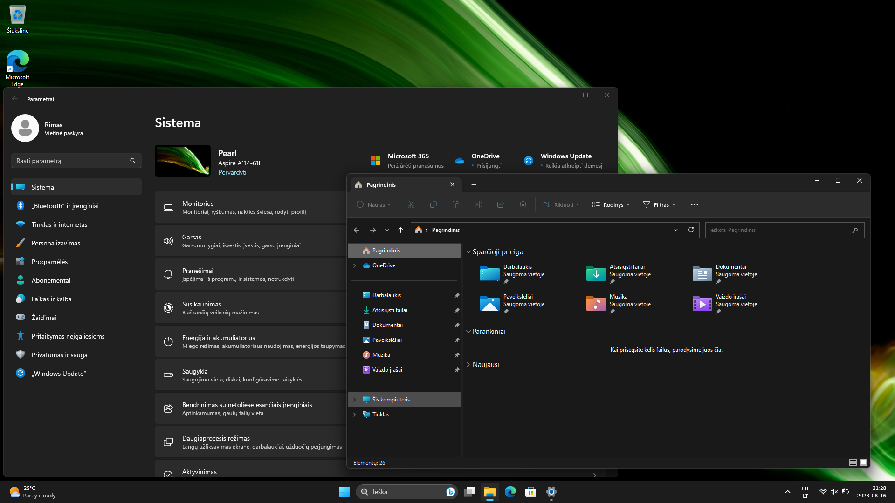
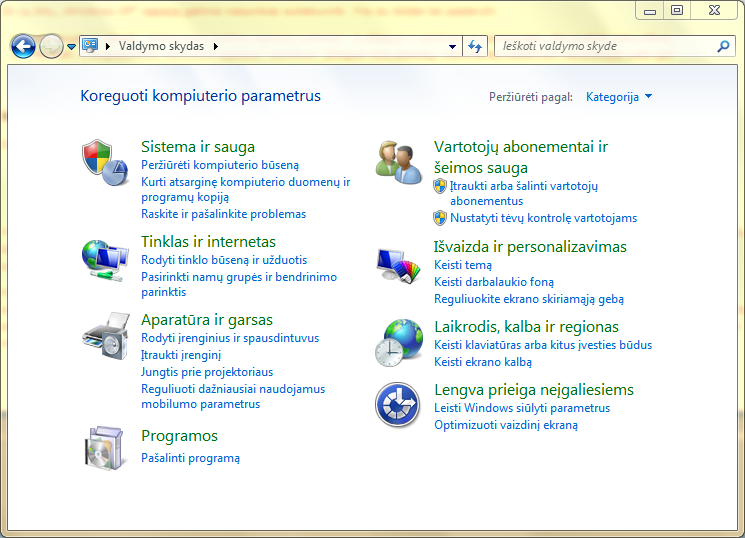
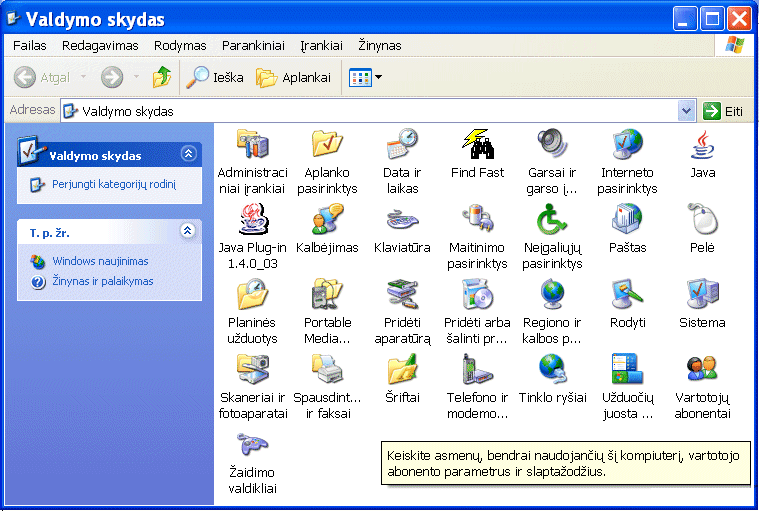

Visos „Windows“ operacinės sistemos versijos, pradedant „Windows XP“, turi lietuvišką sąsają.

Kai kurių gamintojų parduodami kompiuteriai suteikia galimybę pasirinkti šios operacinės sistemos kalbą pirmą kartą
įjungus kompiuterį.

Kad išvengtumėte papildomų vargų, o kai kuriais atvejais – ir abejonių dėl legalumo, patariame dar kompiuterio pirkimo
metu informuoti pardavėją, jog norėtumėte sulietuvintos operacinės sistemos. Tuomet, net jeigu pardavėjas jos neturės,
jis bent jau žinos apie tokį poreikį ir galbūt, kitą kartą perkant kompiuterį, šis klausimas jau bus išspręstas. Nemažai
pardavėjų iki šiol mano, jog sulietuvintos programinės įrangos niekam nereikia. Reikalaudami sulietuvintos operacinės
sistemos, prisidėsite prie šio stereotipo griovimo.

Žemiau pateikiama atskiroms „Windows“ versijoms pritaikyta informacija apie šios šeimos operacinių sistemų
sulietuvinimą.

Windows 10, 11
--------------

Beveik visas „Windows 10“ ir „Windows 11“ šeimos operacines sistemas (išskyrus „vienos kalbos“ leidimus) galima
sulietuvinti. Jei šiuo metu jūsų „Windows“ sąsaja yra angliška ir norite ją sulietuvinti, atlikite šiuos žingsnius:

1. atverkite pradžios meniu (bakstelėkite mygtuką su „Windows“ logotipu, esantį ekrano apatiniame kairiajame kampe) ir
   pasirinkite šio meniu punktą **Settings**;
2. atsivėrusiame lange pasirinkite punktą **Time & language**;
3. kairiajame polangyje pasirinkite skyrių **Region & language** – taip pamatysite šiuo metu įdiegtų kalbų sąrašą;
4. **jeigu lietuvių kalbos nėra įdiegtų kalbų sąraše**, bakstelėkite mygtuką **Add a language**, atsiradusiame kalbų
   sąraše suraskite lietuvių kalbą ir bakstelėkite ją;
5. **jei ties lietuvių kalba matote užrašą „Language pack available“**, nuspauskite ties ja esantį mygtuką **Options**,
   kad būtų atvertos kalbos parinktys. Jose iškart po antrašte „Language options“ ir užrašu „Download language pack“
   bakstelėkite mygtuką **Download**, kad būtų parsiųstas sąsajos kalbos paketas, o tada grįžkite į įdiegtų kalbų
   sąrašą, bakstelėdami mygtuką **←**, esantį viršutiniame kairiajame lango kampe;
6. įdiegtų kalbų sąraše bakstelėkite lietuvių kalbą ir bakstelėkite mygtuką **Set as default**. Toliau vadovaukitės
   kompiuterio nurodymais.

_Parengta pagal „Microsoft“ pateiktą
instrukciją ([lietuvių k.](https://support.microsoft.com/lt-lt/windows/%C4%AFvesties-ir-rodymo-kalbos-parametr%C5%B3-valdymas-sistemoje-windows-12a10cb4-8626-9b77-0ccb-5013e0c7c7a2 "Įvesties ir rodymo kalbos parametrų valdymas sistemoje „Windows“ – „Microsoft“ palaikymas – microsoft.com"), [anglų k.](https://support.microsoft.com/en-us/windows/manage-the-input-and-display-language-settings-in-windows-12a10cb4-8626-9b77-0ccb-5013e0c7c7a2 "Manage the input and display language settings in Windows – Microsoft Support – microsoft.com"))._

Jeigu jūsų kompiuteryje įdiegtas „vienos kalbos“ „Windows“ leidimas, jį sulietuvinti galite, atnaujovinę iki įprastinės
(daugiakalbės) „Home“ versijos. Kitas legalus (ir nemokamas) būdas – kompiuteryje naujai įdiegti vienkalbę operacinės
sistemos versiją lietuvių kalbą.
Tam [iš „Microsoft“ svetainės](https://www.microsoft.com/lt-lt/software-download "Programinės įrangos atsisiuntimas – microsoft.com")
reikėtų parsisiųsti ISO atvaizdį ar savarankiško įdiegimo laikmenos pasigaminimo priemonę.

Ankstesnės „Windows“ versijos
-----------------------------

Primename, jog žemiau išvardintoms „Windows“ versijoms nutrauktas naujinimų tiekimas, todėl jos laikytinos nesaugiomis,
o žemiau pateikiamos instrukcijos laikytinos tiesiog istorine informacija.

### Windows 8, 8.1, RT

Visas „Windows 8“, „Windows 8.1“ ir „Windows RT“ šeimos operacines sistemas taip pat galima sulietuvinti. Tai galite
atlikti, vadovaudamiesi „Microsoft“ svetainėje pateikiama „Windows“ sulietuvinimo instrukcija
(_[lietuvių k.](https://support.microsoft.com/lt-lt/windows/klaviat%C5%ABros-i%C5%A1d%C4%97stymo-keitimas-245c49b8-f856-7fd7-2cf5-41e54c66f5b3 "Klaviatūros išdėstymo keitimas – „Windows“ palaikymas – microsoft.com"), [anglų k.](https://support.microsoft.com/en-us/windows/change-your-keyboard-layout-245c49b8-f856-7fd7-2cf5-41e54c66f5b3 "Change your keyboard layout – Windows Support – microsoft.com"))_.

### Windows Vista, 7

Šių versijų „Windows“ sistemos oficialiai leidosi sulietuvinamos tik dviem atvejais:

1. diegimo metu, diegiant iš disko su lietuvių kalbos sąsajos failais;
2. parsisiunčiant kalbos paketą per „Windows Update“. Deja, ši galimybė suteikta tik „Ultimate“ ir „Enterprise“ versijų
   naudotojams. Instrukcija, kaip tai atlikti „Windows 7“ sistemoje, pateikiama „Microsoft“ svetainėje
   (_[lietuvių k.](https://support.microsoft.com/lt-lt/windows/klaviat%C5%ABros-i%C5%A1d%C4%97stymo-keitimas-245c49b8-f856-7fd7-2cf5-41e54c66f5b3 "Klaviatūros išdėstymo keitimas – „Windows“ palaikymas – microsoft.com"), [anglų k.](https://support.microsoft.com/en-us/windows/change-your-keyboard-layout-245c49b8-f856-7fd7-2cf5-41e54c66f5b3 "Change your keyboard layout – Windows Support – microsoft.com")_).
   „Vista“ atveju įdiegimo žingsniai gali nežymiai skirtis.

Egzistavo ir neoficialus sulietuvinimo
būdas – [„Vistalizator“](https://web.archive.org/web/20210502022009/http://www.froggie.sk/ "Vistalizator – change display language in Windows Vista and Windows 7 – froggie.sk")
_(nuoroda veda į svetainės į archyvą)_. Šis būdas veikė ir su pigesnėmis „Windows Vista“ ir „Windows 7“ versijomis,
tačiau jo legalumas abejotinas, o nepriekaištingas veikimas negarantuotas (nors šios svetainės autoriams jis sėkmingai
suveikė). „Vistalizator“ svetainėje buvo pateikta ir
instrukcija, [kaip pasigaminti „Windows“ įdiegimo diską su keliomis kalbomis](https://web.archive.org/web/20210125224004/https://www.froggie.sk/dvd.html "Make your own Multilanguage installation DVD for Windows Vista or Windows 7 – froggie.sk")
(anglų kalba).

### Windows XP

32-jų bitų „Windows XP“ sąsają buvo galima sulietuvinti visiems kompiuterio naudotojams. Tam reikėjo parsisiųsti ir
įdiegti [lietuvių kalbos sąsajos paketą](LIPSETUP.MSI "Windows® XP LT sąsajos paketas"). Jį įdiegus ir
iš naujo paleidus kompiuterį, šis prabildavo lietuviškai.

„Windows XP“ verslo naudotojams „Microsoft“ siūlė ir kitą variantą – naudoti „Daugiakalbės vartotojo sąsajos“ paketus
(MUI), suteikiančius galimybę kiekvienam kompiuterio naudotojui naudotis skirtinga „Windows“ sąsajos kalba. Deja, namų
naudotojams tokia galimybė nebuvo suteikiama.

