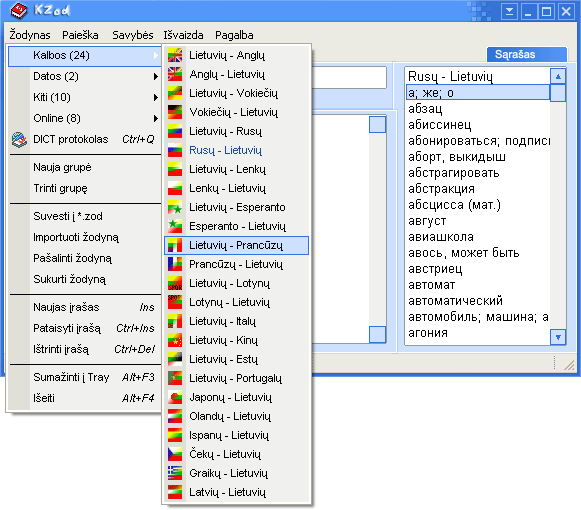

Nemažą žodynų sąrašą yra sudaręs svetainės [www.zodynai.org](http://www.zodynai.org/) autorius Andrej Dunovskij.

Žodynai internete
-----------------

* [„Google vertėjas“](https://translate.google.com/) – visiems žinomo paieškos giganto sukurta vertimo sistema. Suteikia
  galimybę versti tekstą ar pavienius žodžius iš ir į daugybę kalbų. Tekstui versti naudojamas mašininis vertimas,
  kuris, žinoma, nėra tobulas, tačiau atskiriems žodžiams versti ši sparti ir nemokama sistema tinka puikiai.
* [„Omni žodynas“](http://led.ot.lt/) – legali „WinLED“ versija internete. Su šiuolaikinėmis naršyklėmis ji korektiškai
  neveikia, tačiau galite pasinaudoti [alternatyvia jos sąsaja](led/ "„Omni žodynas“ Lietuvybė.lt svetainėje") mūsų
  svetainėje.
* [„IntraLED“](http://www.progress.lt/cgi-bin/intraled.exe) – kita legali „WinLED“ versija internete. Deja, panašu, jog
  nebeveikianti.
* [„KZod“](http://www.dict.lt/?k=zod&lang=lt) – Žilvino Ledo surinkti internetiniai žodynai.

Žodynai kompiuteryje
--------------------

* [„ANGLONAS“](http://anglonas.fotonija.lt/) – „Fotonijos“ kuriamas lietuvių–anglų–lietuvių kompiuterinis žodynas.
  „ANGLONĄ“ galima įsigyti „Windows“, „Mac“ ir „Android“ ir „iPhone“ programų pavidalu. Seniau „Fotonija“ platino ir
  lietuvių–prancūzų–lietuvių žodyną „Windows“ sistemoms „FRANKONAS“, tačiau panašu, jog jo vystymas ir platinimas
  nutrauktas.
* [„KZod“](http://www.dict.lt/?lang=lt) – Žilvino Ledo sukurta nemokama programa elektroniniams žodynams ir
  enciklopedijoms kurti bei peržiūrėti. Ji palaiko DICT, MOVA bei SLOWO formatų žodynus, taip pat sugeba prisijungti
  prie internetinių DICT žodynų serverių. Programa veikia su „Windows“ ir „Linux“ operacinėmis sistemomis. Pateikiama ir
  programos versija mobiliesiems telefonams.  
  
* [„OpenDict“](http://opendict.sourceforge.net/) yra laisva (atviro kodo) žodynų programa. Ja galima dirbti su žodynais
  atvirais formatais: „DICT“, „TMX“, „Mova“, „Slowo“. Taip pat - „LED“ anglų-lietuvių, lietuvių–anglų,
  vokiečių–lietuvių, lietuvių–vokiečių kalbų žodynų priedais (įskiepiais).  
  
* [„WinLED“](https://tevukas.lt/zodynai/WINLED5_dwnl) – lietuviškų žodynų klasika. Dar „Windows 9x“ laikais šis
  lietuvių–anglų, anglų–lietuvių, lietuvių–vokiečių ir vokiečių–lietuvių kalbų žodynas buvo nelegaliai naudojamas
  daugybėje kompiuterių Lietuvoje. Kiek atnaujintą jo kopiją vis dar galima įsigyti ir ja naudotis legaliai.  
  