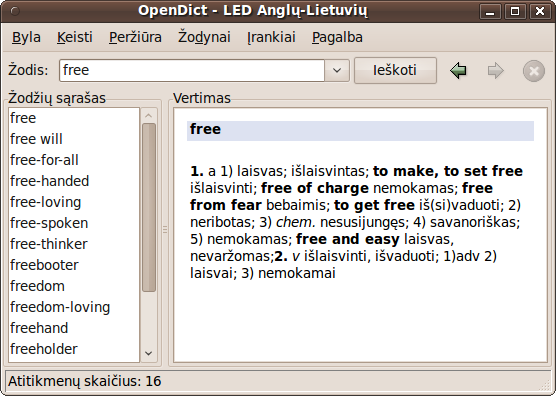
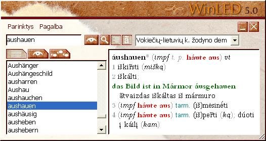

Nemažą žodynų sąrašą yra sudaręs svetainės [www.zodynai.org](http://www.zodynai.org/) autorius Andrej Dunovskij.

Žodynai internete
-----------------

* [„Google vertėjas“](https://translate.google.com/) – visiems žinomo paieškos giganto sukurta vertimo sistema. Suteikia
  galimybę versti tekstą ar pavienius žodžius iš ir į daugybę kalbų. Tekstui versti naudojamas mašininis vertimas,
  kuris, žinoma, nėra tobulas, tačiau atskiriems žodžiams versti ši sparti ir nemokama sistema tinka puikiai.
* [„KZod“](http://www.dict.lt/?k=zod&lang=lt) – Žilvino Ledo surinkti internetiniai žodynai.

Žodynai kompiuteryje
--------------------

* [„ANGLONAS“ ir „ANGLONAS 2“](http://anglonas.fotonija.lt/) – UAB „Fotonija“ vystytas lietuvių–anglų–lietuvių kalbų
  žodynas. „ANGLONĄ“ galima įsigyti „Windows“, „Mac“ ir „Android“ ir „iPhone“ programų pavidalu. Seniau „Fotonija“
  platino ir daugiau žodynų „Windows“ sistemoms, tarp jų ir lietuvių–prancūzų–lietuvių žodyną „FRANKONAS“, tačiau
  panašu, jog šių produktų vystymas ir platinimas nutrauktas.  
  
* [„OpenDict“](http://opendict.sourceforge.net/) yra laisva (atviro kodo) žodynų programa. Ja galima dirbti su žodynais
  atvirais formatais: „DICT“, „TMX“, „Mova“, „Slowo“. Taip pat - „LED“ anglų-lietuvių, lietuvių–anglų,
  vokiečių–lietuvių, lietuvių–vokiečių kalbų žodynų priedais (įskiepiais). Nuo 2017 metų programos vystymas sustojęs.  
  
* „WinLED“ – lietuviškų žodynų klasika. Dar „Windows 9x“ laikais šis lietuvių–anglų, anglų–lietuvių, lietuvių–vokiečių
  ir vokiečių–lietuvių kalbų žodynas buvo nelegaliai naudojamas daugybėje kompiuterių Lietuvoje. Iki 2023 metų pabaigos
  jo kopiją [buvo galima įsigyti](https://web.archive.org/web/20231002233911/https://tevukas.lt/zodynai/WINLED5_dwnl)
  iš leidyklos „TEV“, tačiau panašu, kad tokios galimybės nebėra.  
  
