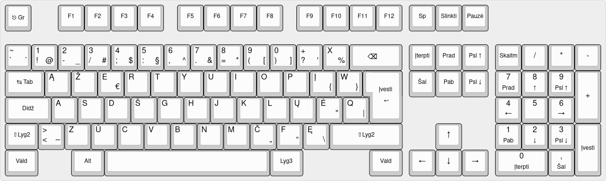
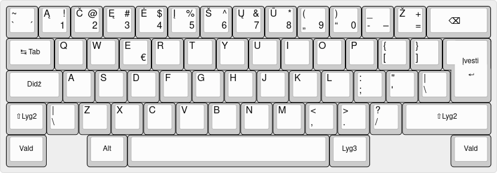
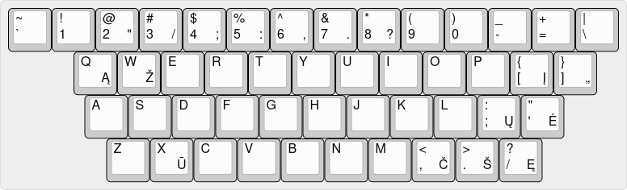

Klaviatūros išdėstymai
======================

Lietuvoje naudojama keletas klaviatūros išdėstymų. Paradoksalu, bet populiariausias jų – skaitmenų eilės išdėstymas –
nėra standartizuotas. Žemiau rasite informaciją apie du pagrindinius Lietuvoje naudojamus klaviatūros išdėstymus bei
apie anksčiau buvusius standartizuotus išdėstymus.

LST 1582 (lietuviška standartinė klaviatūra)
--------------------------------------------

_**Lietuvos standartas LST 1582:2012. Informacinės technologija. Lietuviška kompiuterio klaviatūra. Ženklų
išdėstymas.**_

Standartas apibrėžia galimų įvesti ženklų aibę, išdėstymą kompiuterio klaviatūroje, užrašus ant klavišų. Ženklų aibė
apima visus kodų lentelėse apibrėžtus lietuviškus rašto ženklus. Numatyta kirčiuotų lietuviškų raidžių rinkimo galimybė.
2012 m. standartas atnaujintas (ankstesnė versija buvo žymima numeriu _**LST 1582:2000**_), tačiau skirtumai tarp
versijų tik kosmetiniai – standartizuotas klaviatūros išdėstymas nepakito.

Klaviatūros struktūra, ženklų aibė, jų išdėstymas bei užrašai ant klavišų yra suderinti su tarptautinio klaviatūrų
standarto ISO/IEC 9995 reikalavimais ir atitinka lietuviškoje raštijoje nusistovėjusias normas. Klaviatūros standartas
išverstas į anglų kalbą.

Šis klaviatūros standartas atitinka tarptautinių standartų reikalavimus ir lietuvių kalbos savybes. Be to, derinasi su
visų kitų Europos valstybių, vartojančių lotyniškąją abėcėlę, realiai naudojamomis klaviatūromis. Daugiau informacijos
apie šį klaviatūros išdėstymą, jo tvarkykles ir treniruokles galima rasti jam skirtoje
svetainėje [„Lietuviška standartinė kompiuterio klaviatūra“](http://ims.mii.lt/klav/).

Skaitmenų eilės klaviatūros išdėstymas
--------------------------------------

Tai – populiariausias lietuviškas išdėstymas, paplitęs dar devintajame praėjusiojo amžiaus dešimtmetyje. Jame savitosios
lietuviškos raidės abėcėlės tvarka išdėstytos skaitmenų eilės klavišuose. Skaitmenys įvedami laikant nuspaustą Lyg3
(AltGr) klavišą, o specialieji simboliai – laikant Lyg3 ir Lyg2 (AltGr ir Shift) klavišus.

Šis išdėstymas nėra oficialiai standartizuotas, nors jo kilmę aiškiai galima įžvelgti 1989 m. priimto Lietuvos standarto
RST 1092-89, aprašyto žemiau, priede (2000 m. šis standartas panaikintas, priėmus LST 1582).

Egzistuoja skirtingos šio išdėstymo atmainos. Dažniausiai sutinkama atmaina yra pateikiama kaip numatytasis lietuviškos
klaviatūros išdėstymas su „Windows“ operacinėmis sistemomis. Kiek patobulinta – su „Linux“ ir kitomis UNIX tipo
operacinėmis sistemomis. Pastaroji atmaina papildo su „Windows“ pateikiamą išdėstymą lietuviškomis figūrinėmis
kabutėmis, brūkšniu ir dešininio kirčio ženklu. Būtent jos atvaizdas ir pateikiamas aukščiau. Šio papildyto išdėstymo
tvarkykles „Windows“ bei „macOS“ sistemoms
galima [parsisiųsti iš Rimo Kudelio svetainės](https://rimas.kudelis.lt/numeric/).

### Skaitmenų eilės išdėstymo senoji atmaina („Baltic“)

Egzistuoja ir ankstesnė skaitmenų eilės išdėstymo atmaina – vadinamasis „Baltic“ išdėstymas, kurio pagrindinis skirtumas
nuo šiuolaikinių atmainų – tai, kad skaitmenys ir specialieji simboliai įvedami ne pasitelkiant Lyg3 klavišą, bet per
tęsties („mirusįjį“) klavišą **\`**. Tai iki šiol yra vienintelis lietuviškas fizinės klaviatūros išdėstymas,
pateikiamas su „Apple“ gaminiais.

Anksčiau standartizuoti klaviatūros išdėstymai
----------------------------------------------

Be aukščiau paminėtų, yra dar du klaviatūros išdėstymai, kurie buvo standartizuoti Lietuvoje. **Abu standartai 2000
metais panaikinti**, priėmus LST 1582, tad čia jie pateikti tik istorijos fiksavimo sumetimais.

### LST 1205-92 (IBM)

_LST 1205-92 Skaičiavimo technikos priemonės. Lietuviška kompiuterio klaviatūra. Ženklų išdėstymas._

Standartas aprašė klaviatūrą, turinčią dvi ženklų grupes arba veiksenas (standarte vadinamas režimais): „programuotojo“
ir „lietuviškąją“. „Programuotojo“ veiksenoje klaviatūra turėjo veikti taip pat kaip įprasta amerikinė klaviatūra – jos
išdėstymas buvo identiškas amerikiniam QWERTY išdėstymui. „Lietuviškojoje“ veiksenoje tose vietose, kur QWERTY
klaviatūroje yra raidės Q, W ir X bei dauguma spec. simbolių, buvo sutalpintos savitosios lietuviškos raidės (vaizdas
aukščiau). Konkretus klaviatūros perjungimo tarp ženklų grupių mechanizmas standarte nebuvo numatytas, kaip ir trečiasis
lygis ar kokie nors tęsties klavišai bent vienoje grupėje. Šie faktoriai nulėmė, kad išdėstymas taip ir netapo
populiarus – jo naudotojai turėjo arba jį nuolat perjunginėti į anglišką, arba apsieiti be dalies ženklų (tokių, kaip %
ar @).

Šiek tiek patobulintos šio išdėstymo atmainos iki šiol platinamos su „Windows“ operacinėmis sistemomis ir UNIX šeimos
sistemomis, tačiau jo naudotojų belikę vienetai – dauguma ėmė naudotis panašiu, bet pažangesniu LST 1582 standarto
išdėstymu arba žymiai populiaresniu skaitmenų eilės išdėstymu.

### LST 1092-89 (RST 1092-89, arba FZVPUJ)

_LST 1092-89 Skaičiavimo technikos priemonės. Lietuviška ergonominė kompiuterio klaviatūra. Ženklų išdėstymas._

Originalus lietuviškas standartas, niekada taip ir nesulaukęs net minimalaus populiarumo. Šio išdėstymo tvarkyklės
egzistavo ko gero tik DOS operacinei sistemai – pirmųjų „Windows“ versijų atsiradimo Lietuvoje metu jis tikriausiai jau
buvo užmirštas ir niekam nebeįdomus. Galbūt šią nesėkmę iš dalies nulėmė tai, kad standartas aprašė tik klavišų
žymėjimą, bet ne jų veikimo būdą. Kaip matyti iš iliustracijos, apatinėje klavišų eilėje buvo numatyti net keturi
klaviatūros lygiai (arba dvi grupės po du lygius), tačiau labai tikėtina, jog išdėstymą realizuojant DOS terpei skirtose
tvarkyklėse, trečiasis ir ketvirtasis lygis buvo praleisti, o šitaip „apkarpytu“ išdėstymu, neužsiimant nuolatiniu jo
perjungimu, būtų buvę kone neįmanoma naudotis. Be
to, [bent jau LEKP išdėstymo autorių teigimu](https://lekp.info/RST1092), net ir teisingai realizavus, šis išdėstymas
nėra labai ergonomiškas.

Įdomu, jog greta ergonominio išdėstymo šiame standarte rekomenduojamo priedo pavidalu buvo pateiktas „QWERTY
klaviatūros, papildytos lietuviškomis raidėmis“ brėžinys, tapęs populiariojo Skaitmenų eilės išdėstymo prototipu.

Kiti klaviatūros išdėstymai
---------------------------

Be aukščiau paminėtų, yra ir kitų (alternatyvių) lietuviškų klaviatūros išdėstymų. Kadangi kompiuteryje, priešingai nei
rašomojoje mašinėlėje, naudojamą klaviatūros išdėstymą pakeisti yra labai nesudėtinga, įvairūs efektyvaus spausdinimo
entuziastai kuria, naudoja ir siūlo kitiems savus išdėstymų
variantus. [Kai kurie jų paminėti naudotojams skirtame svetainės skyrelyje.]()
Jame taip pat rasite nuorodų į įvairių klaviatūros tvarkyklių parsisiuntimo tinklalapius.
